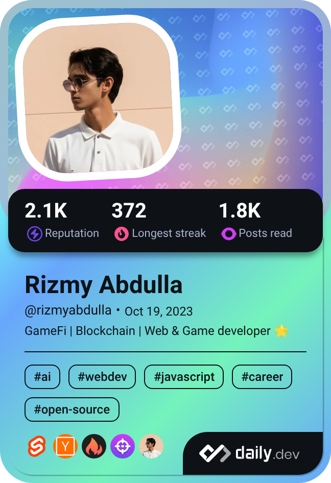

    

<h1 align="center"> Welcome👋</h1>

   

## Connect with me 🙌

        

<h4>About me:</h4>

<ul>
    <li>I'm a 19 year old undergraduate student at London Metropolitan University 🚀</li>
    <li>I’m looking to contribute to open source 🙌</li>
</ul>

<h4 align="end">Explore my work:</h4>

    <a href="https://rizmyabdulla.is-a.dev/">Portfolio</a> • <a href="https://dev.to/rizmyabdulla/">dev.to</a> • <a href="https://www.npmjs.com/~rizmyabdulla">npmjs</a>

<a href="https://dly.to/Ls0vVfSMc5L">Click here</a> to join my daily.dev svelte squad

<!-- <h3 align="start">Connect with me on Discord:</h3>

    

 -->

<h2 align="start">Tech Stack:</h2>

    
    
    
    
    
    
    
    
    
    
    
    
    
    
    
    
    
    
    
    
    
    
    
    
    
    

<h3 align="center">GitHub Stats:</h3>

<!-- 

    

 -->

    

<!-- 

    

 -->

<!-- <h3 align="center">Profile Views:</h3>

    

 -->

<h3 align="center">My git pet 🙃</h3>

    

  

