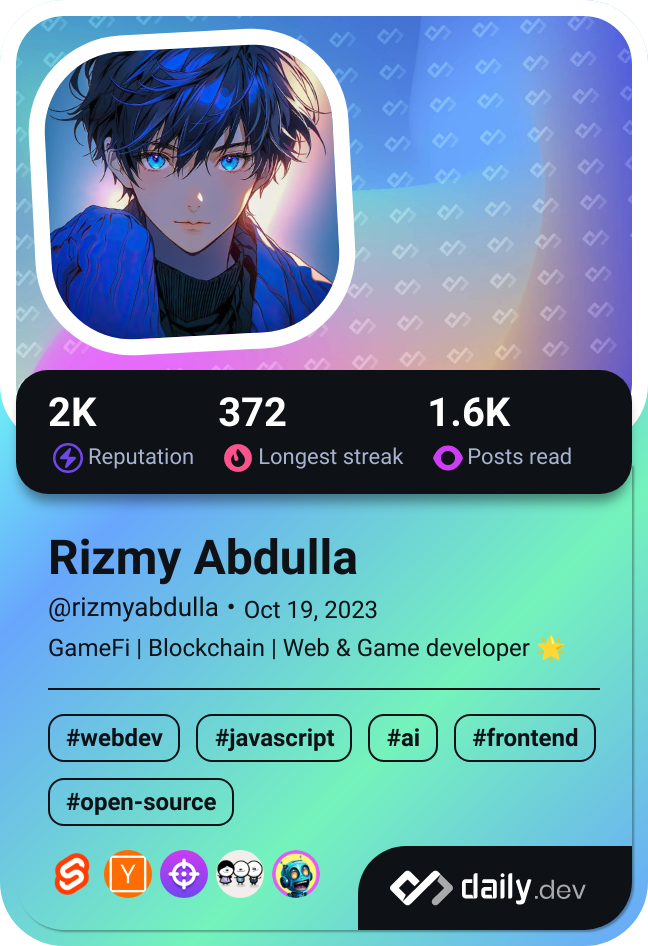

    

<h1 align="center"> Welcome👋</h1>

   

<!--<h3 align="center">Web Developer | Game Developer | App Developer | Open Source Enthusiast</h3>-->

## Connect with me 🙌

<h4>About me:</h4>

<ul>
    <li>I'm a 17 year old undergraduate student at NIBM 🚀</li>
    <li> I’m currently developing a school web app 🏫</li>
    <li>I’m looking to contribute to open source 🙌</li>
    <li>Fun fact: I love to create games 👾</li>
</ul>

<h4 align="end">Explore my work:</h4>

    <a href="https://rizmyabdulla.is-a.dev/">Portfolio</a> • <a href="https://dev.to/rizmyabdulla/">dev.to</a> • <a href="https://www.npmjs.com/~rizmyabdulla">npmjs</a>

<h3 align="start">Connect with me on Discord:</h3>

    

<h2 align="end">Tech Stack:</h2>

    
    
    
    
    
    
    
    
    
    

<h3 align="center">GitHub Stats:</h3>

    

    

    

<h3 align="center">Profile Views:</h3>

    

  

